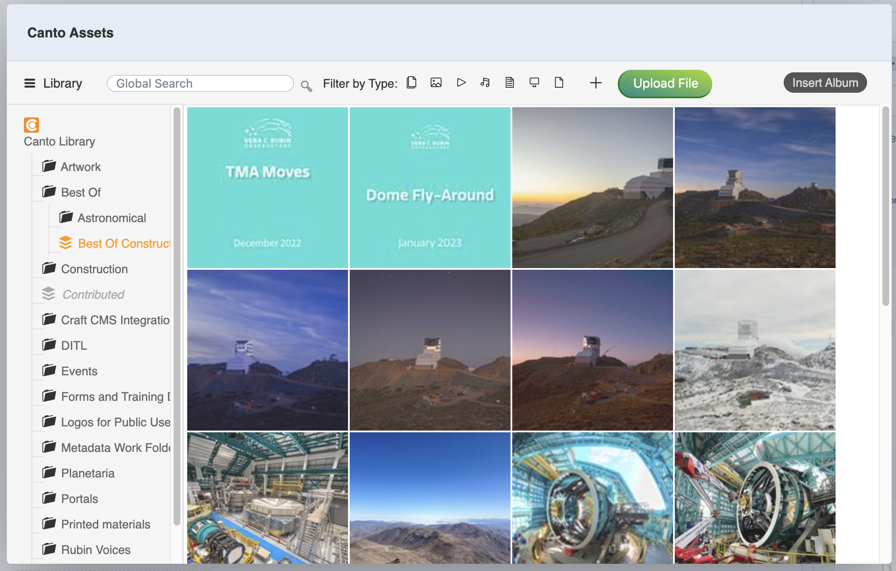
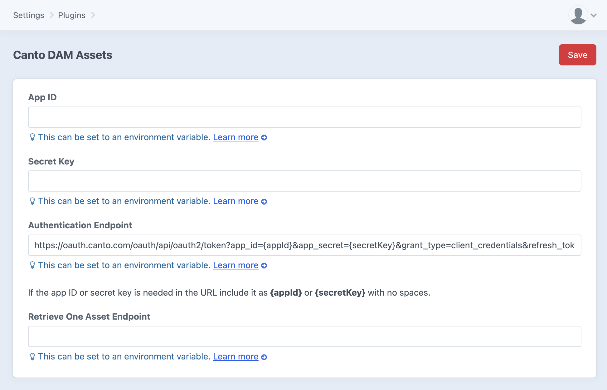
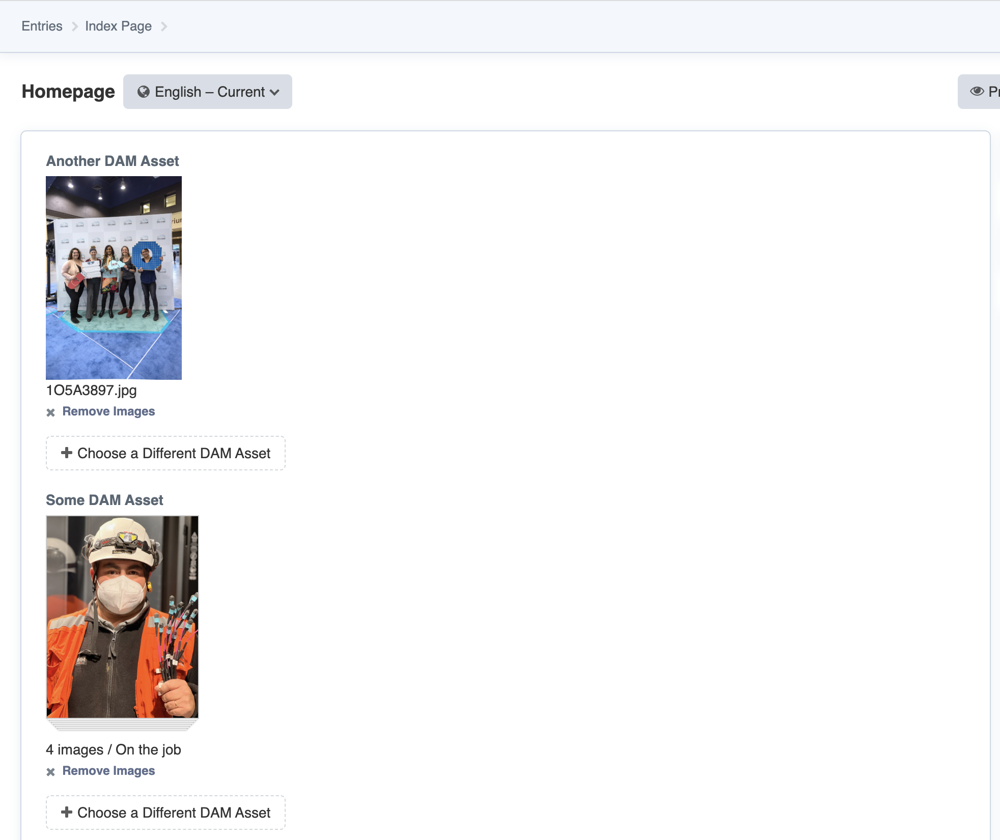
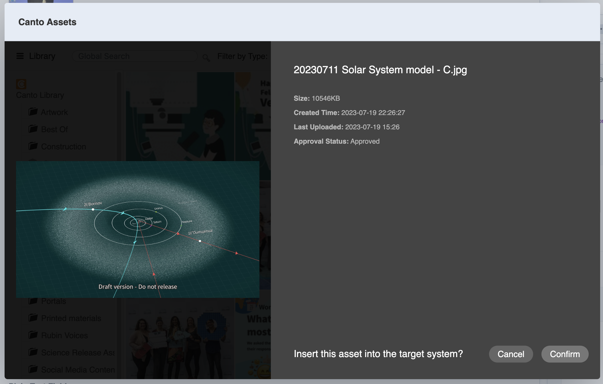
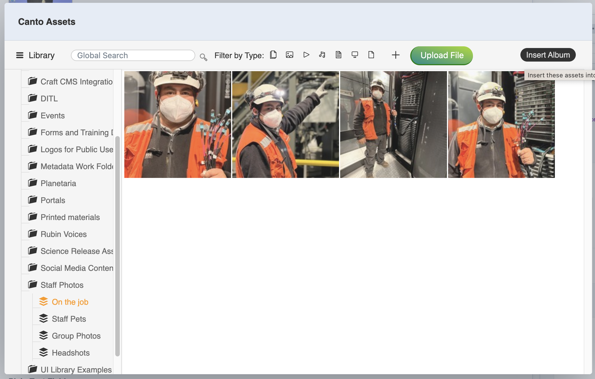

# Canto DAM Assets


This Craft CMS plugin adds a Field Type with GraphQL support for the [Canto Digital Asset Management](https://www.canto.com/product/) (DAM) web system.

## Overview

This plugin works by leveraging a modified version of the [Canto Universal Connector](https://support.canto.com/en/support/solutions/articles/9000159770-universal-connector) to provide the asset picker for your Canto library inside of Craft CMS.



It stores all of the selected Canto asset data in Craft CMS as a JSON blob, which can be accessed via Twig or GraphQL.

The Canto asset data is represented as a [Laravel Collection](https://laravel.com/docs/10.x/collections), allowing you to use the various [Collection methods](https://laravel.com/docs/10.x/collections#available-methods) to search, sort, filter, etc. the data.

## Requirements

This plugin requires Craft CMS 4.4.0 or later, and PHP 8.0.2 or later.

## Limitations

While the Canto DAM Assets plugin will allow you to select and utilize assets other than images, currently a preview is only displayed if the asset is an image.

## Configuring

Before you can use the Canto DAM Assets plugin, you need to configure it via **Settings &rarr; Plugins &rarr; Canto DAM Assets**:



* **App ID** - Your Canto DAM Application ID
* **Secret Key** - Your Canto DAM secret key
* **Authentication Endpoint** - The URL that should be used to authenticate and obtain an access token from. You can include the `{appId}` & `{secretKey}` tokens in the URL, which will be replaced with the respective values from the settings
* **Retrieve One Asset Endpoint** - The URL to the endpoint provided by Canto for retrieving meta data for individual assets. This will be unique for your application

## Content Authoring With The Canto DAM Asset field

You can have multiple Canto DAM Asset fields in any entry in Craft CMS:



If a single image is selected, a preview of it will appear with the name of the image, and the album it comes from.

If you have multiple images selected (such as for an entire album of images), a preview of the first image will appear with the number of images and the album they come from, with a stack below it as a visual cue that there are multiple images.

Clicking on **Remove Images** will remove the images from the field.

Clicking on **Choose a Different DAM Asset** will bring up the Canto Universal Connector UX the allows you to choose the asset(s) to use:

### Single Asset

To choose a single asset, click on the image for a detail view, when click on **Confirm** to use the image:



### Multiple Assets

To select multiple assets, click on the circle in the upper-right corner of each image (a &check; will appear), and then click on the **Insert** button:

### And Entire Album

To select an entire album, click on the album in the list view on the left, then click on the **Insert Album** button:



## Canto DAM Field Data Structure

Just like [Assets](https://craftcms.com/docs/4.x/assets.html) in Craft CMS, each Canto DAM Field stores data for an array of `n` assets. So a single Canto DAM Asset is treated the same as a gallery of 10 Canto DAM Assets.

The data the Canto DAM Asset field type stores is as follows, each in their own separate table in the `content` table of the Craft CMS database. The separate `content` table columns allows for easy searching based on the `cantoId` or `cantoAlbumId` which are broken out of their respective data structures:

* `cantoId` - The `id` of the Canto Asset, or `0` if this is a collection of images
* `cantoAlbumId` - The `id` of the Canto Album
* `cantoAssetData` - A JSON blob that is an array of Canto DAM Assets
* `cantoAlbumData` - A JSON blob of Canto DAM Album data

## Canto DAM Asset Data Structure

The selected Canto DAM Asset data is stored as a JSON blob with a structure that mirrors the results from the [`batch/content`](https://api.canto.com/#c9483281-c667-4ec2-be64-c07632680f2d) endpoint combined with the data from the undocumented `batch/directuri` endpoint.

Below are the available fields for the Canto Asset Data of the scheme `image`; the fields may vary for other asset types:

```
{
  id
  uid
  metadata {
    BitsPerPixel
    FileTypeDetail
    FileTypeExtension
    FlightFileExtension
    GIFVersion
    BackgroundColor
    AnimationIterations
    WHRotated
    RSize
    FlightFileType
    FileName
    ColorResolutionDepth
    Comment
    CreateDate
    FileInodeChangeDateTime
    FileType
    ImageSize
    FileAccessDateTime
    ImageHeight
    Orientation
    ImageWidth
    DurationTime
    FileModificationDateTime
    MIMEType
    FinfotoolVersion
    AssetDataSizeLong
    Megapixels
    HasColorMap
    FrameCount
    Panoramas
  }
  height
  relatedAlbums {
    id
  }
  md5
  approvalStatus
  ownerName
  smartTags
  dpi
  lastUploaded
  versionHistory {
    no
    ownerName
    created
    time
    version
    comment
    currentVersion
  }
  created
  keyword
  time
  tag
  additional {
    Description
    UploadedBy
    WebDAMGroupID
    SpatialReferenceValue
    SpatialCoordinateSystemProjection
    MetadataVersion
    UploaderContact
    Credit
    WebDAMPublisherID
    AltTextES
    PublisherID
    SpatialReferenceDimension
    WebDAMPublisher
    AltTextEN
    ID
    SocialMediaDescription
    TitleES
    TitleEN
    MediaConsent
    SpatialRotation
    Title
    Publisher
    SpatialScale
    SpatialReferencePixel
    WebDAMSublocation
    SpatialCoordinateFrame
    CaptionES
    Type
    SocialMediaHandles
    CaptionEN
    UsageTerms
    WebDAMMediaType
  }
  url {
    preview
    download
    metadata
    HighJPG
    PNG
    directUrlOriginal
    detail
    directUrlPreview
    LowJPG
  }
  width
  name
default {
    Size
    UploadedBy
    Dimensions
    GPS
    DateUploaded
    DateModified
    Name
    Copyright
    ModifiedBy
    LowJPG
    ContentType
    Author
    DateCreated
    Resolution
  }
  size
  scheme
  owner
  displayName
  directUri
  previewUri
  preview
  previewUri
}
```

You can use the [GraphiQL IDE](https://craftcms.com/docs/4.x/graphql.html#using-the-graphiql-ide) built into Craft CMS to explore the data structure interactively.

## Using Twig

You can access the data stored in a Canto DAM Asset field type via Twig by accessing it as you would any other field type. In the examples below, `someDamAsset` is the field handle of a Canto DAM Asset field:

```twig
{{ entry.someDamAsset.cantoAssetData.first().url.directUrlOriginal }}
```

Note that `cantoAssetData` is a [Laravel Collection](https://laravel.com/docs/10.x/collections) that contains an `array` of Canto DAM Assets, so we are using the [`.first()`](https://laravel.com/docs/10.x/collections#method-first) method to get the first item from the array, and then we are accessing the `url.directUrlOriginal` of the Canto DAM Asset data structure.

Since `cantoAssetData` is a Laravel Collection, all [Collection methods](https://laravel.com/docs/10.x/collections#available-methods) are available to operate on the Canto DAM Asset data.

Craft CMS also provides a `.one()` method that aliases to `.first()`, so you can use that as well to mirror how [Element Queries](https://craftcms.com/docs/4.x/element-queries.html) work, if you like.

## Using GraphQL

You can also access the data stored in a Canto DAM Asset field type via Craft CMS's [GraphQL API](https://craftcms.com/docs/4.x/graphql.html) inside of an Entry query.

In the examples below, `someDamAsset` is the field handle of a Canto DAM Asset field:

### Simple Queries

```graphql
{
  entry(section: "homepage") {
    ... on homepage_homepage_Entry {
      someDamAsset {
        id,
        url {
          directUrlOriginal
        }
      }
    }
  }
}

```

For a Canto DAM Assets field that has one asset, the response will look like this:

```json
{
  "data": {
    "entry": {
      "someDamAsset": [
        {
          "id": "vjbnb7df8t6b3al3sumpo66s0n",
          "url": {
            "directUrlOriginal": "https://Example.canto.com/direct/image/vjbnb7df8t6b3al3sumpo66s0n/ZgZdSVOt9ZxsSjf1AKd4ficjBcE/original?content-type=image%2Fjpeg&name=IMG_0599.jpeg"
          }
        }
      ]
    }
  }
}
```

For a Canto DAM Asset field that contains multiple assets, the response will look like this:

```json
{
  "data": {
    "entry": {
      "someDamAsset": [
        {
          "id": "vjbnb7df8t6b3al3sumpo66s0n",
          "url": {
            "directUrlOriginal": "https://Example.canto.com/direct/image/vjbnb7df8t6b3al3sumpo66s0n/ZgZdSVOt9ZxsSjf1AKd4ficjBcE/original?content-type=image%2Fjpeg&name=IMG_0599.jpeg"
          }
        },
        {
          "id": "docn3e2imd5cncpfk78aatvb1h",
          "url": {
            "directUrlOriginal": "https://Example.canto.com/direct/image/docn3e2imd5cncpfk78aatvb1h/m8MCieLzJVnwfofy5HG9ZSi6qF8/original?content-type=image%2Fjpeg&name=IMG_0790.jpeg"
          }
        },
        {
          "id": "k9qquhbn2l2vn4c8t9jnr5l90e",
          "url": {
            "directUrlOriginal": "https://Example.canto.com/direct/image/k9qquhbn2l2vn4c8t9jnr5l90e/afyd7vgCFoqesmf6JrEejLwHaIM/original?content-type=image%2Fjpeg&name=IMG_0604.jpeg"
          }
        },
        {
          "id": "v7jrfok1r57k5fq20trm8bnt0a",
          "url": {
            "directUrlOriginal": "https://Example.canto.com/direct/image/v7jrfok1r57k5fq20trm8bnt0a/RqGiM6RPSnndSIMlbCy5YeOt4BQ/original?content-type=image%2Fjpeg&name=IMG_0602.jpeg"
          }
        }
      ]
    }
  }
}
```

In both cases, the data will be a JSON array of Canto DAM Asset data structures.

### Complex Queries

You can also treat the Canto DAM Asset data as a database, and do queries based on the content of fields or sub-fields there.

This works by mapping a subset of  [Collection methods](https://laravel.com/docs/10.x/collections#available-methods) to arguments in GraphQL.

In the examples below, `someDamAsset` is the field handle of a Canto DAM Asset field.

So for example, this query:

```graphql
{
  entry(section: "homepage") {
    ... on homepage_homepage_Entry {
      someDamAsset(where: {key: "default.Author", value: "Hernan Stockebrand"}, sortByDesc: "default.Size") {
        id,
        url {
          directUrlOriginal
        }
      }
    }
  }
}
```

...will return all of the Canto DAM Assets in the `someDamAsset` field that have the `default.Author` set to `Hernan Stockebrand`, sorted in descending order by the `default.Size` field.

Only a subset of Collection methods are available as arguments in your GraphQL query, because only some Collection methods return Collection data directly.

#### Query Arguments
Here's a list of the available arguments, and the types they expect as parameters:

* [`except`](https://laravel.com/docs/10.x/collections#method-except): `[Int]` - Get all items except for those with the specified indexes.


* [`first`](https://laravel.com/docs/10.x/collections#method-first): `Boolean` - Get the first item from the collection.


* [`last`](https://laravel.com/docs/10.x/collections#method-last): `Boolean` - Get the last item from the collection.


* [`nth`](https://laravel.com/docs/10.x/collections#method-nth): `Int` - Return a collection consisting of every n-th element.


* [`random`](https://laravel.com/docs/10.x/collections#method-random): `Int` - Get the specified number of items randomly from the collection.


* [`reverse`](https://laravel.com/docs/10.x/collections#method-reverse): `Boolean` - Reverse the list


* [`shuffle`](https://laravel.com/docs/10.x/collections#method-shuffle): `Int` - Shuffle the items in the collection, using the value as a random number seed.


* [`skip`](https://laravel.com/docs/10.x/collections#method-skip): `Int` - Skip the first N items.


* [`sortBy`](https://laravel.com/docs/10.x/collections#method-sortby): `[String]` - Sort the collection using the sort string(s). You can use the `field.subField` syntax for nested fields and provide multiple sort commands as a list of strings.


* [`sortByDesc`](https://laravel.com/docs/10.x/collections#method-sortbydesc): `[String]` - Sort the collection using the sort string(s) in a descending order. You can use the field.subField syntax for nested fields and provide multiple sort commands as a list of strings.


* [`where`](https://laravel.com/docs/10.x/collections#method-where): `WhereFiltersInput` - Get all items by the given key value pair, using the optional operator for comparison.


* [`whereBetween`](https://laravel.com/docs/10.x/collections#method-wherebetween): `WhereBetweenFiltersInput`
Filter items such that the value of the given key is between the given values. 


* [`whereIn`](https://laravel.com/docs/10.x/collections#method-wherein): `WhereInFiltersInput` - Filter items such that the value of the given key is in the array of values provided.


* [`whereNotBetween`](https://laravel.com/docs/10.x/collections#method-wherenotbetween): `WhereNotBetweenFiltersInput` - Filter items such that the value of the given key is NOT between the given values. This argument expects exactly three values in an array. You can use the field.subField syntax for nested fields.


* [`whereNotIn`](https://laravel.com/docs/10.x/collections#method-wherenotin): `WhereNotInFiltersInput` - Filter items by the given key value pair, making sure the value is not in the array.


* [`whereNotNull`](https://laravel.com/docs/10.x/collections#method-wherenotnull): `String` - Return items from the collection where the given key is not null. You can use the `field.subField` syntax for nested fields.


* [`whereNull`](https://laravel.com/docs/10.x/collections#method-wherenull): `String` - Return items from the collection where the given key is null. You can use the `field.subField` syntax for nested fields.

#### Query Argument types

* `WhereFiltersInput` - Used with the `where` argument, in the format: `{key: "key", value: "value", operator: "operator"}`:

  * `key`: `String` - The key to search on, you can use the `field.subField` syntax for nested fields

  * `value`: `String` - The value to match when searching

  * `operator`: `String` - The comparison operator to use, e.g.: =, >, <=, etc. The default is =


* `WhereBetweenFiltersInput` - Used with the `whereBetween` argument, in the format: `{key: "key", values: ["value1", "value2"]}`:

  * `key`: `String` - The key to search on, you can use the `field.subField` syntax for nested fields

  * `values`: `String` - The values that the key should be between


* `WhereInFiltersInput` - Used with the `whereIn` argument, in the format: `{key: "key", values: ["value1", "value2"]}`:

  * `key`: `String` - The key to search on, you can use the `field.subField` syntax for nested fields

  * `values`: `String` - The values that should be in the key


* `WhereNotBetweenFiltersInput` - Used with the `whereNotBetween` argument, in the format: `{key: "key", values: ["value1", "value2"]}`:

  * `key`: `String` - The key to search on, you can use the `field.subField` syntax for nested fields

  * `values`: `String` - The values that the key should not be between


* `WhereNotInFiltersInput` - Used with the `whereNotIn` argument, in the format: `{key: "key", values: ["value1", "value2"]}`:

  * `key`: `String` - The key to search on, you can use the `field.subField` syntax for nested fields

  * `values`: `String` - The values that should not be in the key

You can use the [GraphiQL IDE](https://craftcms.com/docs/4.x/graphql.html#using-the-graphiql-ide) built into Craft CMS to try queries interactively.

## Plugin Roadmap

Some things to do, and ideas for potential features:

* Add preview support for the display of video, PDFs, etc. in the Canto DAM Asset field type
* Convert the `canto-field.js` to TypeScript
* Add tests to the plugin
* Consider submitting the plugin to the [Plugin Store](https://plugins.craftcms.com/)
* Consider submitting the plugin to the [Canto Integrations](https://www.canto.com/integrations/) page

Brought to you by [nystudio107](https://nystudio107.com/)
